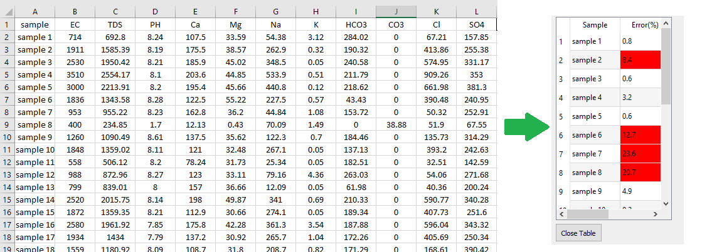
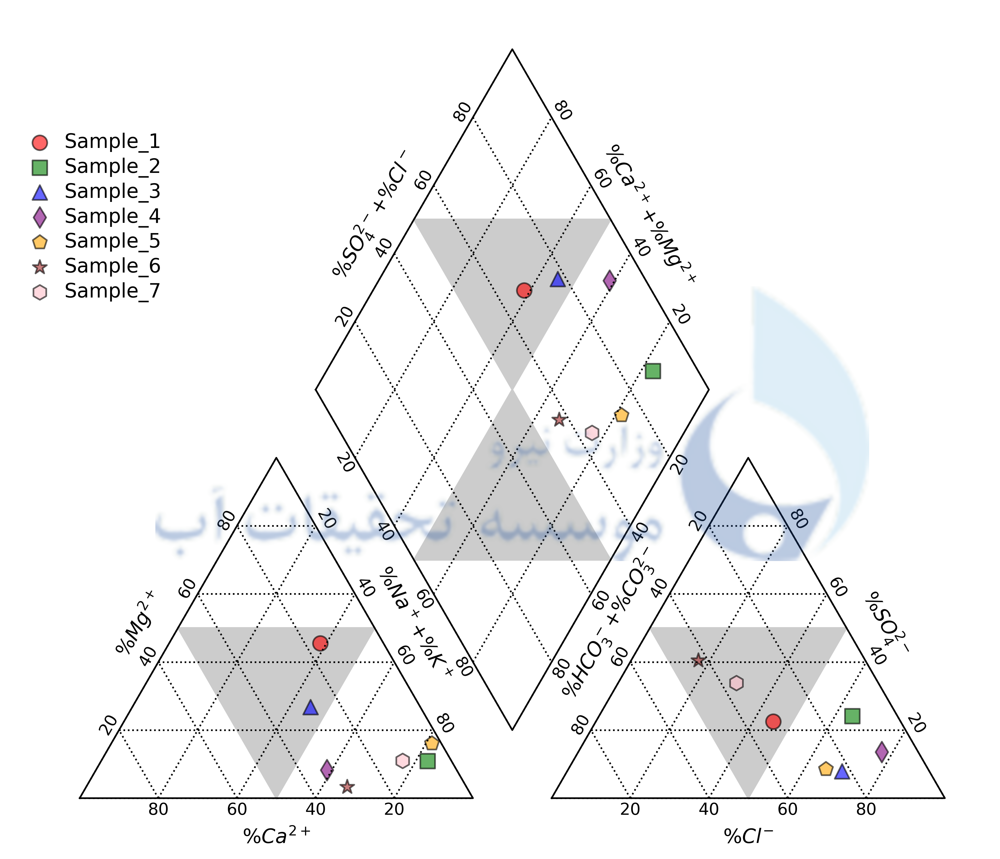
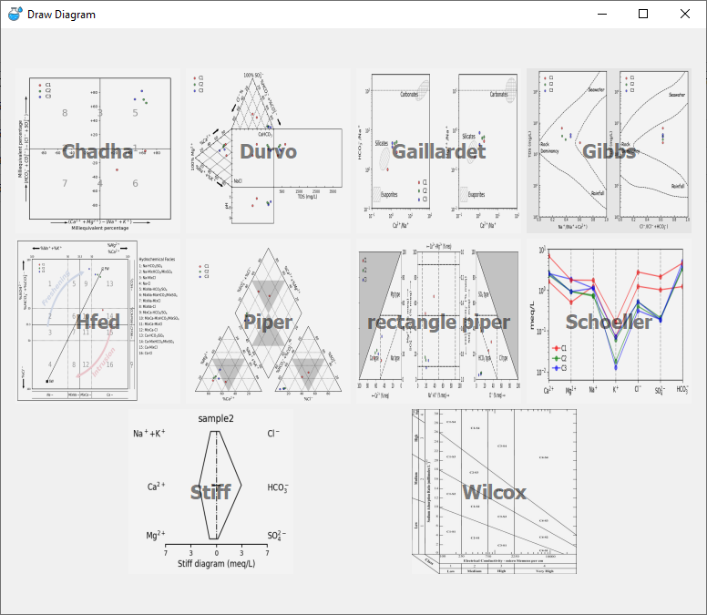

# HydroQual Prime: Intelligent Water Quality Monitoring System

**HydroQual Prime (v1.0)** is a comprehensive hydro-informatics software developed to automate the analysis, visualization, and validation of water quality data. Developed at the **Water Research Institute (Ministry of Energy)**, this tool bridges the gap between raw laboratory data and actionable management insights by integrating 14 global quality indices and 10 advanced hydrochemical diagrams.

> ⚠️ **Note on Source Code:**
> This software is part of a **National Elites Foundation** project and a Master's thesis. Due to intellectual property regulations, the **source code is currently protected**.
> The executable version is available for research and demonstration purposes in the [Releases](../../releases) section.

---

## 🎯 Key Capabilities

Traditional water quality analysis involves manual calculation of complex indices and drawing diagrams in different software (Excel, etc.). **HydroQual Prime** integrates all these steps into a single automated workflow:

### 1. Automated Validation (CBE Check)
Before analysis, the software automatically checks the **Charge Balance Error (CBE)**.
* Calculates sum of Cations and Anions.
* Identifies samples with **CBE > 5%** (invalid data).
* Prevents erroneous data from entering the analysis pipeline.

  
   
  <em>Figure 1: The intelligent error-handling system detecting invalid data entries.</em>

### 2. Comprehensive Quality Indices (14 Models)
The software calculates 14 diverse indices to evaluate water for drinking, irrigation, and industrial use:
* **Global Indices:** NSFWQI, WQI, OWQI, BCWQI, WAWQI, Liou, CWQI.
* **Specific & Localized Indices:** IRWQIsc (Surface), IRWQIGC (Groundwater), DWQI (Drinking - Localized), IEWQI (Irish), PoS.
* **Industrial/Risk Indices:** Langelier Saturation Index (LSI), Metal Index (MI).

  
   
  <em>Figure 2: Automated calculation of multiple quality indices and report generation.</em>

### 3. Advanced Hydrochemical Visualization (10 Diagrams)
Generates high-resolution (600 DPI) diagrams for hydrogeochemical evolution analysis:
* **Classification:** Piper, Schoeller, Stiff, Wilcox.
* **Evolution & Origin:** Gibbs, Chadha, Durov, Gaillardet.
* **Specialized:** HFE-D (Hydrochemical Facies Evolution), Rectangle Piper.

  
   
  <em>Figure 3: Advanced plotting engine generating Piper, Durov, and Stiff diagrams instantly.</em>

---

## 📸 Main Interface

  
   
  <em>Figure 4: Main dashboard featuring data management and diagram selection tools.</em>

---

## 🛠️ Technical Architecture

* **Core Engine:** Python 3.9
* **GUI Framework:** PyQt5 (Modular MVC Architecture)
* **Data Processing:** Pandas, NumPy (High-speed matrix calculations)
* **Visualization:** Matplotlib (Customized for hydro-diagrams)
* **Database:** SQLite (Local structured storage)

## 🔗 Reference

This software was developed as a technical research project for the **Water Research Institute (Ministry of Energy)**.
> **Nemati Mansour, A.** (2025). *Development of Intelligent Water Quality Monitoring Software (HydroQual Prime)*. National Elites Foundation Project, Water Research Institute, Tehran.

## 👨‍💻 Developer & Contact

**Amirreza Nemati Mansour**
* *Research Fellow & Software Developer*
* 📧 Email: [amirreza.nemati@ut.ac.ir](mailto:amirreza.nemati@ut.ac.ir)
* 🔗 [GitHub Profile](https://github.com/AmirrezaNemati)

---
**Copyright © 2025 Amirreza Nemati Mansour. All Rights Reserved.**
